# [Render](https://project2-shopapp.onrender.com)

Heres my mediocre Website

# Project Overview

This project is an online shop that has all the fundamentals needed to run an online shop, minus the variety in products and the ability to actualy pay.

There are a few bugs that make the user experience unfortunate at times, however the overall goal to ensure that the website can interact with a database is fully functional.

# Development Process
## Planning
As for the solitaire project 3 weeks ago, I created draft mockups of the designs of each page before building them. 

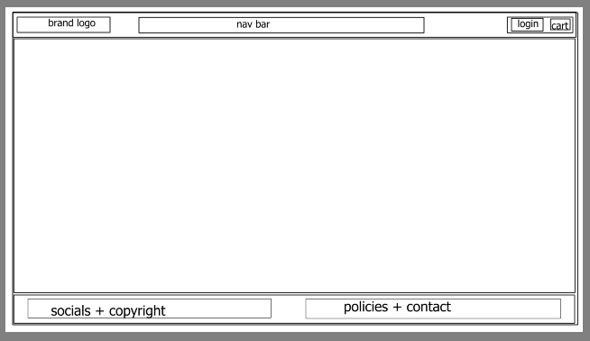
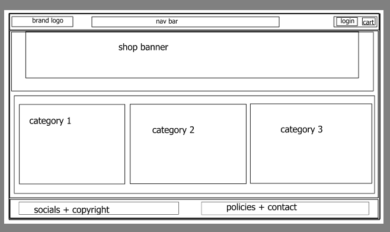
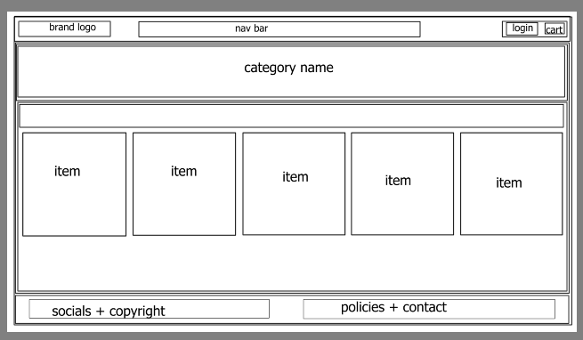
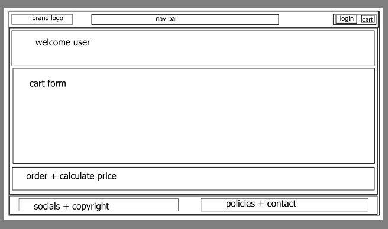

## Development
Creating the base css for the website was my first goal, however I made some additional changes as I developed the webapp. As always, I focused on the function of the webapp more than I did the styling, and it would be one of the main changes I'd make if I had more time to work on the website.

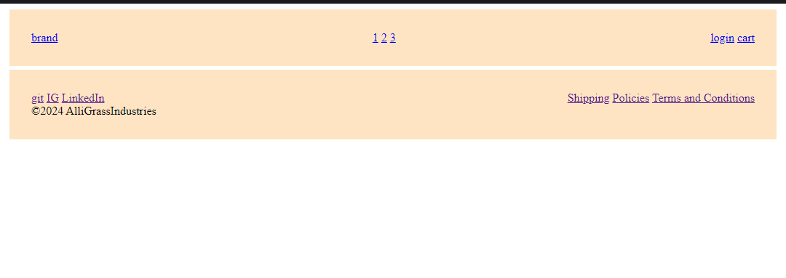
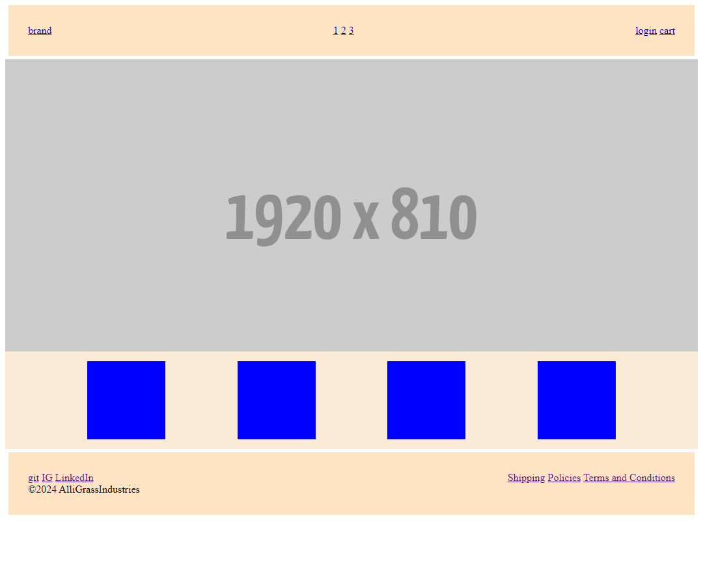
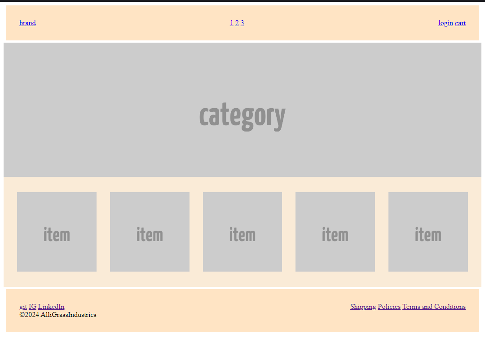
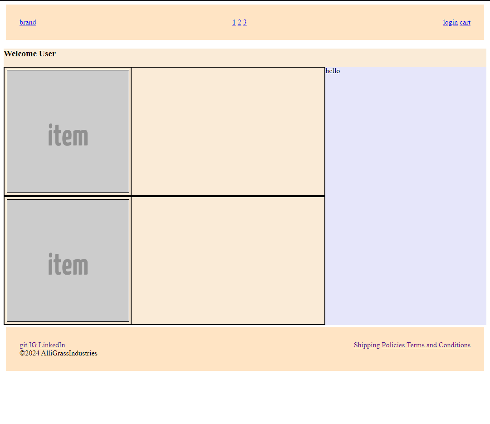

Naturally, I made some minor adjustments to the styling of the pages, but not nearly enough for it to look like a professional website.

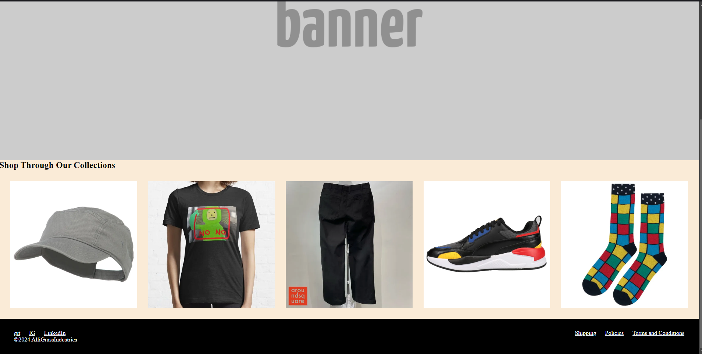
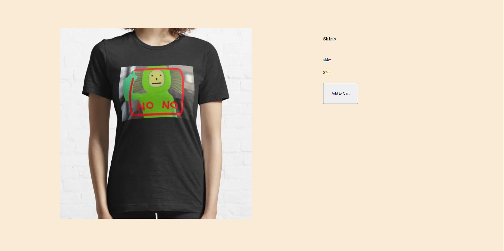
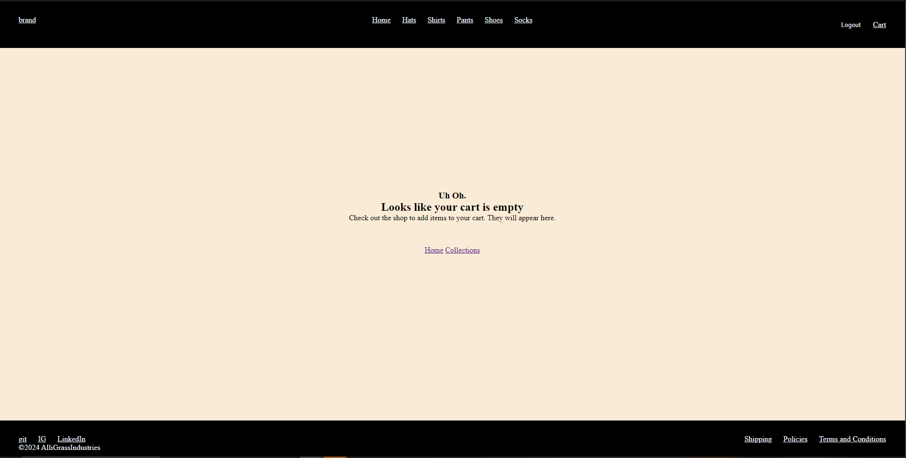

I included a reviews section for the items to fill space, however at this point there is no possible way through the webapp to be able to post a review.

The user management was unique as I didn't create an entirely separate page, but rather a popup box so that users can login from whichever page they were on. Further, the signup and login were in the same popup. With a simple click of a button users can create an account instead with needing to be taken to an entirely separate page.

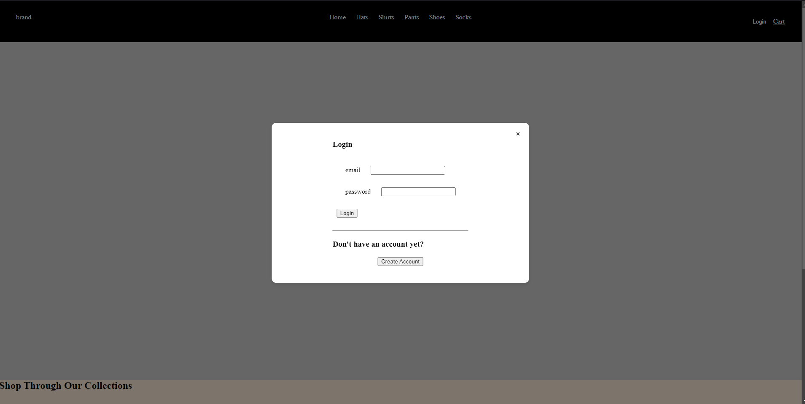
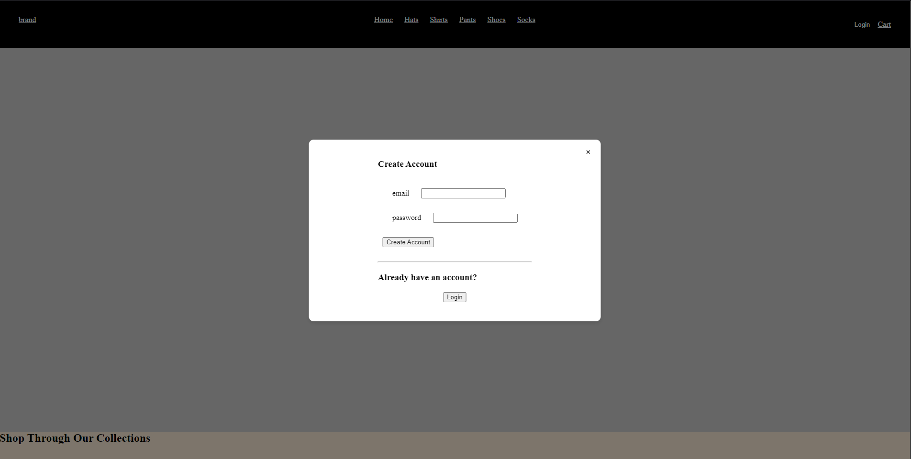

An admin page was also implemented, and so if the user that has logged in has admin priviledges, they will be able to see the edit button on their page.

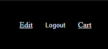

You may notice that the edit page, accessible to the admin, is not styled well, and also doesn't have a mockup design. It is precisely for that reason why I need a mockup design for the pages I create.

# Improvements
Included is a login in popup rather than an entirely separate page. This causes a few issues when redirecting to the 'login page' since no login page exists. Instead the user is sent to the home page, and without knowing that is the intended function the user may assume the site is unfinished or incomplete. Technically, they'd be correct, however I spent hours trying to have the webapp redirect to the popup, however this required a mix of ejs and js code, which was out of my skill range for the short amount of time I had.

